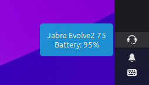

# JabBar 🎧

**JabBar** is a Cinnamon desktop applet that integrates your Jabra headset with your Linux desktop. It provides a convenient way to monitor your device status, battery level, and more, directly from your taskbar.



## ✨ Features

*   **Device Detection**: Automatically detects when a Jabra device is connected or disconnected.
*   **Battery Monitoring**: Real-time battery level updates and charging status.
*   **Smart Notifications**: Get notified when your device connects, disconnects, or when the battery is low.
*   **Head Detection**: (Supported devices) Detects if you are wearing the headset.
*   **Customizable**: Configure notification preferences and critical battery thresholds.

## 🚀 Prerequisites

Before installing, ensure you have the following dependencies:

*   **Cinnamon Desktop Environment**
*   **Build Tools**: `make`, `gcc`
*   **GObject Introspection**: `libgirepository1.0-dev` (Debian/Ubuntu) or equivalent.
*   **Patchelf**: Required to set the RPATH for the shared libraries.

```bash
# Ubuntu/Debian
sudo apt install build-essential libgirepository1.0-dev patchelf
```

## 🛠️ Installation

1.  **Clone the repository:**
    ```bash
    git clone https://github.com/kolos/jabbar.git
    cd jabbar
    ```

2.  **Build the project:**
    This will compile the GObject wrapper and prepare the applet files.
    ```bash
    make
    ```

3.  **Install the Applet:**
    Link or copy the applet to your local Cinnamon applets directory.
    ```bash
    mkdir -p ~/.local/share/cinnamon/applets/
    ln -s $(pwd)/src/applet ~/.local/share/cinnamon/applets/jabbar@kolos
    ```

4.  **Setup Device Permissions (Udev Rules):**
    To allow the applet to communicate with the Jabra device without root privileges, install the provided udev rules.
    ```bash
    sudo cp udev/99-jabra.rules /etc/udev/rules.d/
    sudo udevadm control --reload-rules && sudo udevadm trigger
    ```

5.  **Enable the Applet:**
    *   Right-click on your Cinnamon panel.
    *   Select **Applets**.
    *   Find **JabBar** in the list and click the **+** button to add it.

## ⚙️ Configuration

Right-click the JabBar icon in the panel and select **Configure** to access settings:

*   **Enable Notifications**: Toggle desktop notifications for device events.
*   **Critical Battery Level**: Set the percentage at which you want to receive a low battery warning.

## 🔧 Troubleshooting

**Applet shows an error or doesn't load:**
*   Check the Cinnamon logs (Looking Glass) by pressing `Alt + F2`, typing `lg`, and checking the "Log" tab.
*   Ensure `libjabra.so` and `libjabbar-gobject.so` are correctly located in the applet folder.

**Device not detected:**
*   Ensure the udev rules are installed and you have re-plugged your device.
*   Check if another application is exclusively using the device.

## 📜 License & Credits

*   This project uses the **Jabra SDK** for Linux.
*   **JabBar** is open-source software.

---
*Note: This project is not affiliated with or endorsed by Jabra/GN Audio A/S.*
